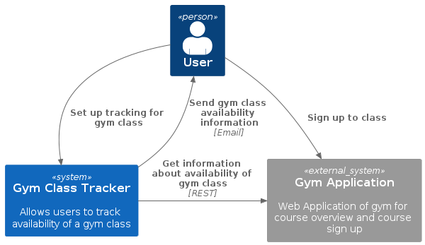

# Gym class tracker

The gym class tracker is a very simple application that can setup a "tracker query" to the REST of a Gym for the availability of a class.



The application is built using a simple serverless setup with *Lambda*, *DynamoDB*, *SNS* and *EventBridge Scheduler*.


The "tracker query" and its current state are stored in *DynamoDB*. A *Lambda function* contains the logic to call the gym API and check if the class of interest is currently available to be booked. For any status changes or errors, a notification is sent to a (fixed) user using *SNS*. The Lambda Function is called regularly using an *Event Bridge Scheduler* 


## Project structure

This project uses the [AWS Serverless Application Model (SAM)](https://aws.amazon.com/serverless/sam/) and was built using the [AWS Toolkit in VSCode](https://docs.aws.amazon.com/toolkit-for-vscode/latest/userguide/welcome.html).

Folder structure:
- `execute-check` - Code for the Lambda function executing a check against the gym's API.
- `events` - Invocation events that you can use to invoke the function.
- `tests` - Unit tests for the application code. 
- `template.yaml` - A template that defines all the application's AWS resources.
- `docs` - Diagrams for documentation
- `proof-of-concept` - First draft of the Lambda function which was originally manually deployed

## Deploy the sample application

To build and deploy the application for the first time, run the following in your shell:

```bash
sam build --use-container

# this will guide you through installation and prompt for the stack name, AWS region and capability to create IAM roles (to create/modifycIAM roles, the `CAPABILITY_IAM` value for `capabilities` must be set). Arguments can be savet to samconfig.toml
sam deploy --guided
```

After the first deployment, these comments can be used to deploy changes:

```bash
sam build 
sam deploy --parameter-overrides EmailAddress=[enter email address to send notifications] 
```

## Use the SAM CLI to build and test locally

**Build** your application with the `sam build --use-container` command.

```bash
# build: installs dependencies and creates a deployment package in .aws-sam/build
sam build --use-container
```

**Run functions locally** and invoke them with the `sam local invoke` command. Test events are included in the `events` folder in this project.

```bash
sam local invoke ExecuteCheckFunction --event events/empty-call.json
```

## Fetch, tail, and filter Lambda function logs

**Read logfiles** from the deployed Lambda function using the SAM CLI:
```bash
sam logs -n ExecuteCheckFunction --stack-name gym-class-tracker --tail
```

## Create a tracker query

Example for a query in DynamoDB
```
{
  "partition-key": {
    "S": "query-1"
  },
  "sort-key": {
    "S": "1"
  },
  "entity-name": {
    "S": "check-query"
  },
  "active-status": {
    "S": "1"
  },
  "availability-status": {
    "S": "Unknown"
  },
  "center-id": {
    "S": "23"
  },
  "course-title": {
    "S": "BODYPUMP® 55'"
  },
  "daytime-id": {
    "S": "4"
  },
  "weekday-id": {
    "S": "3"
  }
}
```

### Variables

center-id:
* 23 = Zürich Altstetten

daytime-id:
* 1 = morning
* 2 = noon
* 3 = afternoon
* 4 = evening

weekday-id:
* 1 = Monday
* ... 
* 7 = Sunday

## Cleanup

**Delete** the deployed application again:
```bash
sam delete gym-class-tracker
```

## Resources
* [AWS SAM developer guide](https://docs.aws.amazon.com/serverless-application-model/latest/developerguide/what-is-sam.html): for an introduction to SAM specification, the SAM CLI, and serverless application concepts.
* [AWS Serverless Application Repository main page](https://aws.amazon.com/serverless/serverlessrepo/): Discover, deploy and publish serverless applications

## Improvement options
- [ ] Split `app.py` into different files: separate for DynamoDB, API handling and SNS
- [ ] Add tests for separate areas
- [ ] build additional Lambda CreateTrackerQuery that writes a tracker-query into DynamoDB
- [ ] build API Gateway for CreateTrackerQuery
- [ ] Secure API Gateway
- [ ] Enable different email addresses (maybe move away from SNS for this?)
